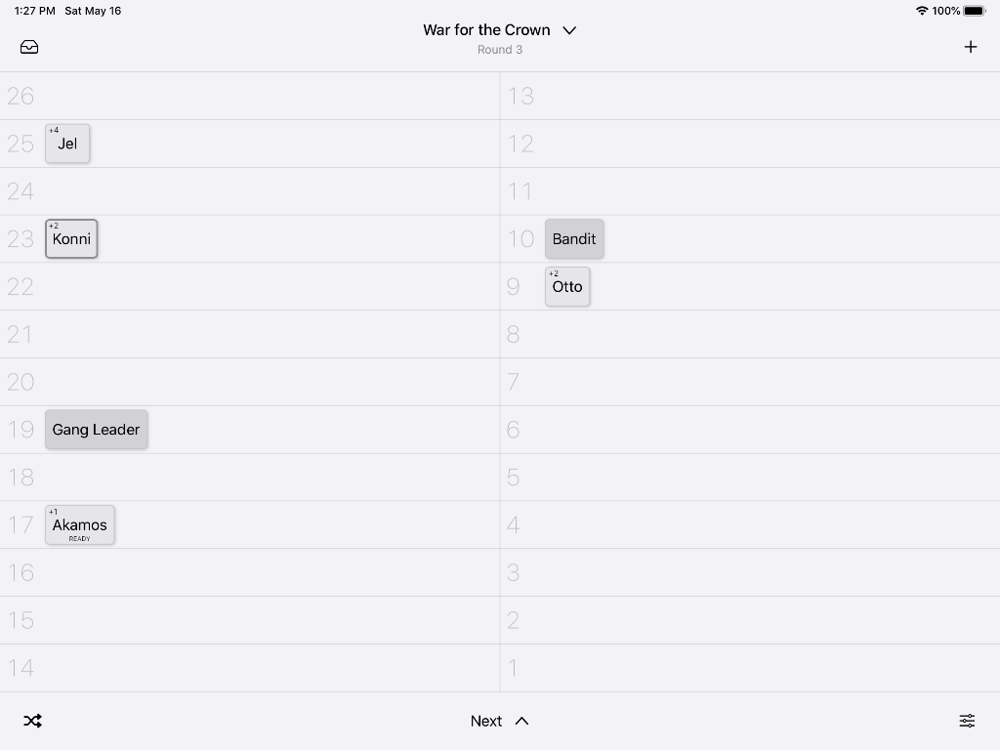

# Turn Tracker for iPad

This is basically InitiativeBoard v2.0.

The app fully supports:  

* all device orientations
* dark mode
* slide-over
* multitasking
* hardware keyboards

The following features from InitiativeBoard are not implemented

* tracking of hitpoints or statuses (unlikely to make a reappearance)
* pre-populating lists of NPC names (likewise)

## Major UI changes from InitiativeBoard

The grid now fully adapts to the available screen size. This means that rotating the device changes the range of available initiative values. Tiles automatically move to the nearest possible new value, and remember their original initiative value (it is also displayed in the upper right corner).

Dragging tiles to the top edge of the screen temporarily removes them from display. Tap the tray icon to re-add them later.

This is how it looks:

  

### Controls around the board

There are 6 controls around the board. Here's what they do:

#### + (top right)

This adds a new NPC to the board. NPCs are usually added in the top-right slot, in order to be quickly accessible after adding. When "Auto-roll Initiative" is turned on in the app's settings, the NPC will appear in its newly rolled Initiative slot.

To create a new PC, tap on an NPC, choose edit and change the type to PC.

#### Settings (bottom right)

Opens the app settings. Dismiss via "Done" or slide-down.

#### Next (bottom center)

Moves the "active" marker to the next tile.

#### Shuffle (bottom left)

Roll initative for all tiles, just the PCs, or just the NPCs.

#### Tray (top left)

Re-adds inactive tiles to the board. Tiles are always added in the top-left slot, in order to be quickly accessible after re-adding.

#### "Campaign" (top center)

Edit the campaign's name.

## Keyboard control

If you have a hardware keyboard connected to your iPad, you can use it to control parts of the app. 

* Left Arrow: moves the active marker to the previous tile
* Right Arrow: moves the active marker to the next tile (Same as tapping "Next")
* +: adds a new NPC, same as tapping the "+" Button
* ⌘-E: edit the currently active tile. Same as tapping on it and selecting "Edit"
* ⌘-R: resets the board for the next encounter. Remove all NPCs, move all PCs to the highest initiative. Same as tapping "Reset" in the popup of the "Next" button
* ⌘-S: cycles through the 3 available status values on the active tile: normal, ready and delay.

Hold the ⌘ (Command) key to show a list of all available shortcuts.

## Known issues

* Some icons are ugly
* The app icon is the same as InitiativeBoard's
* I'm not 100% sure about the name
* The color (or rather, gray-scale) scheme is probably not ideal
